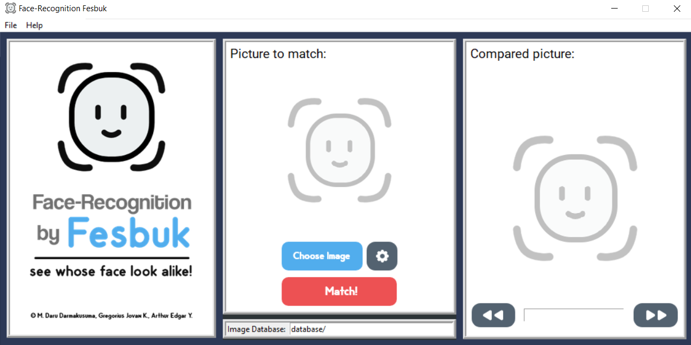
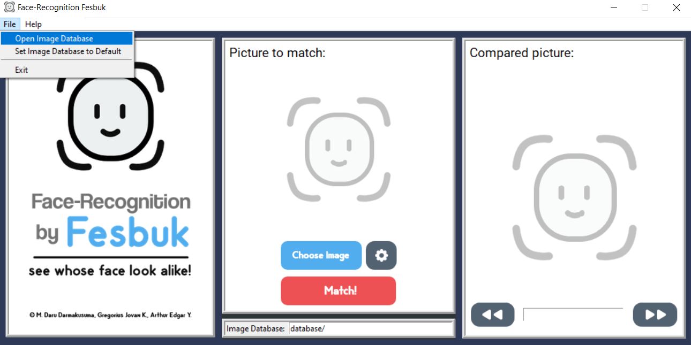
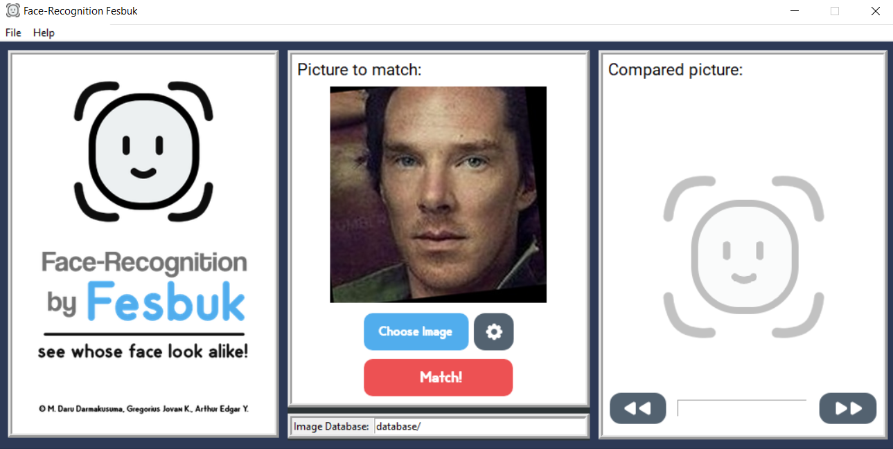
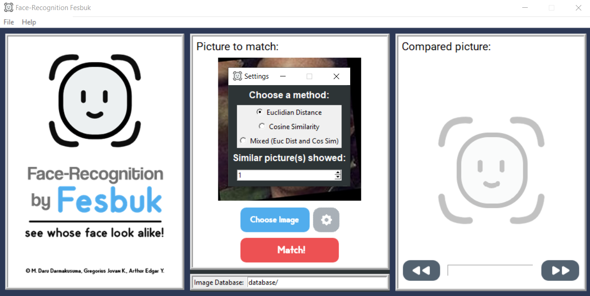
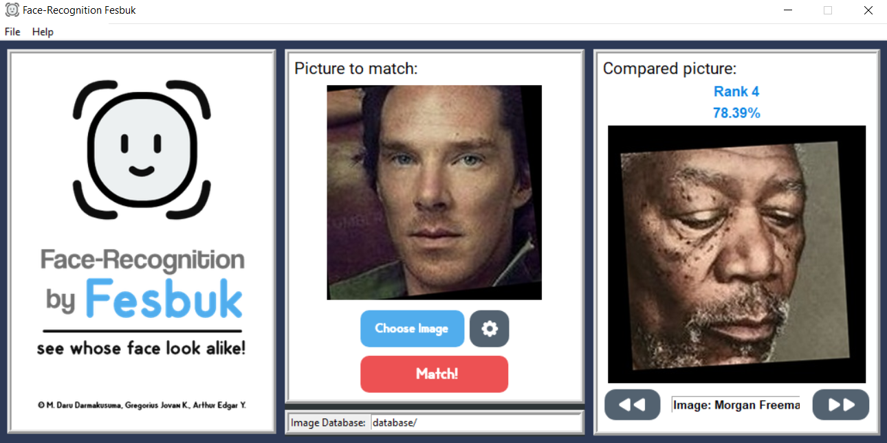
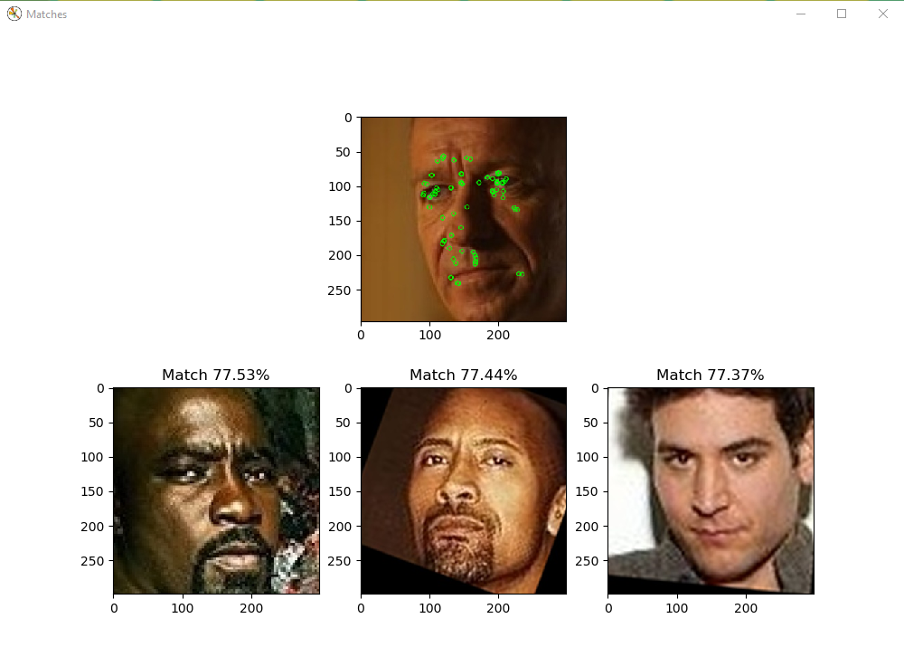

# Tubes2Algeo_18057 - Aplikasi Metrik Berbasiskan Vektor pada Aplikasi Face Recognition

Program ini adalah contoh penerapan metrik Berbasiskan Vektor di dalam Sistem Pengenalan Wajah (Face Recognition)

## Derivables
* bin: Hasil packing basis data gambar dalam bentuk ekstensi .pck
* doc: README dan dokumentasi program
* database: basis data atau data referensi yang disediakan pada spesifikasi tugas besar (80%)
* test: data uji yang disediakan dari spesifikasi (20%)
* src: script python, program utama, dan assets

## Instalasi Program

Program ini dibuat menggunakan bahasa pemrograman Python oleh karena itu dibutuhkan Python interpreter versi 3.7.4 atau lebih tinggi. Interpreter dapat diunduh melalui https://www.python.org/downloads/release/python-374/
Setelah Python diinstall, lakukan clone pada repository ini, atau download dalam file .zip dan extract ke folder yang diinginkan.

### Prerequisites

Sebelum menjalankan program, terdapat beberapa library yang harus diunduh dan diinstall melalui Command Prompt agar program bisa berjalan dengan benar. Berikut adalah daftar command untuk menginstall library-library ini dapat menggunakan pip.

```
pip install --upgrade pip
pip install numpy
pip install matplotlib
pip install opencv-python
pip install Pillow
pip install scipy
```
Detail versi setiap library yang digunakan saat development:
```
matplotlib==3.1.1
Pillow==6.2.1
opencv-python==4.1.1.26
scipy==1.3.1
numpy==1.17.3
```

## Cara Menjalankan Program Menggunakan GUI

Setelah Python dan semua library berhasil diinstall, maka program dapat dijalankan. Untuk menjalankan programnya, bukalah terminal dari directory src dan silakan jalankan programnya. Berikut adalah instruksi untuk menjalankan programnya :

```
C:\Users\<user>\Documents\GitHub\Tubes2Algeo_18057\src>
# python facerecog_gui.py
```
atau
```
C:\Users\<user>\Documents\GitHub\Tubes2Algeo_18057\src>
# py facerecog_gui.py
```

### Cara Menggunakan Program

Setelah instruksi di atas diketik, akan keluar sebuah GUI (Graphical User Interface) seperti di bawah yang menandakan bahwa program telah berjalan dengan benar.


Pertama, pilih file database yang akan dibaca. Namun, sudah ditentukan database default, jadi dapat dipilih langsung gambar yang akan menjadi referensi.


Untuk memilih gambar referensi, tekan tombol "Choose Image", dan pilih gambarnya.


Lalu ada beberapa pengaturan yang bisa ditentukan pada tombol setting (sebelah kanan tombol "Choose Image"), seperti:
- Metode yang digunakan untuk mencari gambar yang mirip (Euclidian Distance, Cosine Similarity, atau keduanya)
- Jumlah gambar mirip yang akan ditampilkan


Jika pengaturan sudah selesai, tekan tombol "Match" untuk memulai pencarian gambar yang mirip. Gambar yang mirip akan ditampilkan di kolom "Compared picture", beserta rankingnya dan persentase kemiripan. Untuk menavigasi antargambar, tekan tombol "Prev Image" atau "Next Image"


## Cara Menjalankan Program Menggunakan Command Line

Setelah Python dan semua library berhasil diinstall, maka program dapat dijalankan. Untuk menjalankan programnya, bukalah terminal dari directory src dan silakan jalankan programnya. Berikut adalah instruksi untuk menjalankan programnya :
```
C:\Users\<user>\Documents\GitHub\Tubes2Algeo_18057\src>
# python facerecog_cli.py
```
atau
```
C:\Users\<user>\Documents\GitHub\Tubes2Algeo_18057\src>
# py facerecog_cli.py
```
Contoh input program setelah dieksekusi:
```
Images database folder path: ../database/
Random sample? (y/n): y
Images sample(s) folder path: ../test/
How many match result shown: 3
How many sample to match: 1
```

Setelah instruksi di atas diketik, akan keluar seperti di bawah yang menandakan bahwa program telah berjalan dengan benar.


## Kontributor
Program ini dibuat untuk memenuhi salah satu Tugas Besar IF2123 Aljabar Geometri Teknik Informatika ITB. Adapun pembuat dari program ini adalah :
[ Kelompok Fesbuk ]
* Muhammad Daru Darmakusuma - 13518057
* Arthur Edgar Yunanto      - 13518090
* Gregorius Jovan Kresnadi  - 13518135

Note: Program stable in Windows, unstable in Linux and other Unix Systems.

https://github.com/arthuredgary24/TubesAlgeo_FaceRecognition

